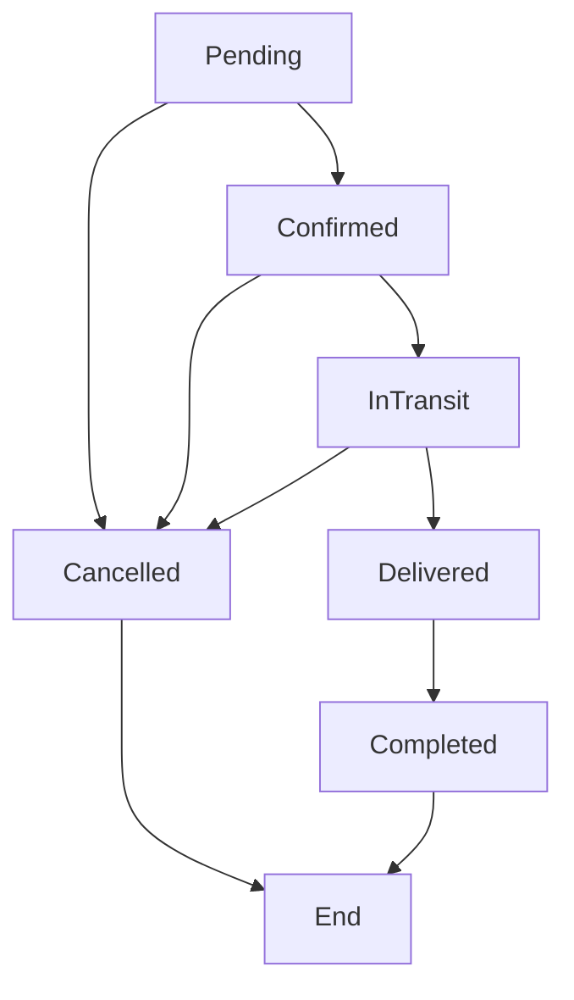
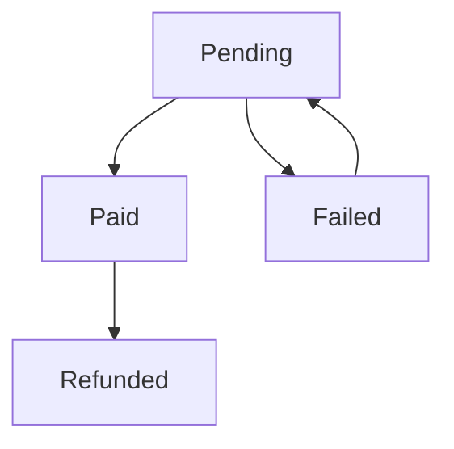

# Order Management System API Documentation

> Comprehensive order management system for Shamba2Shelf platform - facilitating seamless transactions between farmers and buyers with complete order lifecycle management.

[](https://nodejs.org/)
[](https://www.mongodb.com/atlas)
[](https://expressjs.com/)

## 📋 Overview

The Order Management System provides end-to-end order processing capabilities for the Shamba2Shelf platform. It handles order creation, status management, payment processing, delivery tracking, and comprehensive analytics while ensuring secure transactions between coffee farmers and buyers.

### Key Features

- **Complete Order Lifecycle** - From creation to completion
- **Payment Processing** - Multiple payment methods with status tracking
- **Status Management** - Real-time order status updates and transitions
- **Delivery Management** - Address validation and delivery tracking
- **Role-based Access** - Secure operations based on user roles
- **Analytics & Reporting** - Comprehensive order insights and statistics
- **Inventory Integration** - Automatic stock management and updates
- **Business Logic Validation** - Smart validation for order transitions

## 🏗️ System Architecture

```
┌─────────────────┐    ┌─────────────────┐    ┌─────────────────┐
│   Client App    │    │   Order API     │    │   MongoDB       │
│   (Frontend)    │◄──►│   Controller    │◄──►│   Order         │
│                 │    │                 │    │   Collection    │
└─────────────────┘    └─────────────────┘    └─────────────────┘
                                │
                        ┌───────┴───────┐
                        │               │
                   ┌─────▼─────┐   ┌─────▼─────┐
                   │  Product  │   │   Farmer  │
                   │Collection │   │Collection │
                   └───────────┘   └───────────┘
```

## 🚀 API Endpoints

### Base URL
```
/api/orders
```

### Authentication Required
All order endpoints require JWT authentication. Include the token in the Authorization header:
```
Authorization: Bearer <your-jwt-token>
```

---

## 📦 Order Endpoints

### 1. Get All Orders
Retrieve orders based on user role with pagination and filtering.

**Endpoint:** `GET /api/orders`

**Access:** Requires authentication (Returns user-specific orders)

**User-specific Behavior:**
- **Buyers**: See only their orders
- **Farmers**: See only orders for their products
- **Admins**: See all orders

**Query Parameters:**
- `page` (optional): Page number (default: 1)
- `limit` (optional): Items per page (default: 10)
- `sort` (optional): Sort fields (e.g., '-createdAt', 'totalAmount')
- `fields` (optional): Specific fields to return
- `status` (optional): Filter by order status
- `paymentStatus` (optional): Filter by payment status
- `totalAmount[gte]` (optional): Minimum order value
- `totalAmount[lte]` (optional): Maximum order value

**Example Request:**
```bash
GET /api/orders?page=1&limit=5&sort=-createdAt&status=Pending
```

**Success Response (200):**
```json
{
  "success": true,
  "count": 5,
  "total": 23,
  "pagination": {
    "next": {
      "page": 2,
      "limit": 5
    }
  },
  "data": [
    {
      "_id": "64a1b2c3d4e5f6789012345",
      "quantity": 25,
      "unitPrice": 750,
      "totalAmount": 18750,
      "status": "Pending",
      "paymentStatus": "Pending",
      "deliveryAddress": {
        "street": "123 Coffee Street",
        "city": "Nairobi",
        "county": "Nairobi",
        "postalCode": "00100"
      },
      "productId": {
        "_id": "64a1b2c3d4e5f6789012346",
        "name": "Premium AA Coffee",
        "variety": "SL28",
        "roastLevel": "Medium",
        "price": 750,
        "images": ["https://example.com/image1.jpg"]
      },
      "farmerId": {
        "_id": "64a1b2c3d4e5f6789012347",
        "firstName": "John",
        "lastName": "Doe",
        "location": {
          "county": "Nyeri",
          "subCounty": "Mathira"
        },
        "contactInfo": {
          "phone": "+254712345678"
        }
      },
      "buyerId": {
        "_id": "64a1b2c3d4e5f6789012348",
        "firstName": "Jane",
        "lastName": "Smith",
        "contactInfo": {
          "phone": "+254787654321"
        }
      },
      "createdAt": "2024-01-20T10:30:00.000Z",
      "updatedAt": "2024-01-20T10:30:00.000Z"
    }
  ]
}
```

---

### 2. Get Order by ID
Retrieve detailed information about a specific order.

**Endpoint:** `GET /api/orders/:id`

**Access:** Requires authentication (Order participant only)

**Authorization:**
- **Buyers**: Can view their own orders
- **Farmers**: Can view orders for their products
- **Admins**: Can view all orders

**Path Parameters:**
- `id`: Order ID (MongoDB ObjectId)

**Example Request:**
```bash
GET /api/orders/64a1b2c3d4e5f6789012345
```

**Success Response (200):**
```json
{
  "success": true,
  "data": {
    "_id": "64a1b2c3d4e5f6789012345",
    "quantity": 25,
    "unitPrice": 750,
    "totalAmount": 18750,
    "status": "Confirmed",
    "paymentStatus": "Paid",
    "paymentMethod": "M-Pesa",
    "paymentReference": "MP240120123456",
    "paidAt": "2024-01-20T11:15:00.000Z",
    "deliveryAddress": {
      "street": "123 Coffee Street",
      "city": "Nairobi",
      "county": "Nairobi",
      "postalCode": "00100",
      "coordinates": {
        "latitude": -1.2921,
        "longitude": 36.8219
      }
    },
    "productId": {
      "_id": "64a1b2c3d4e5f6789012346",
      "name": "Premium AA Coffee",
      "variety": "SL28",
      "roastLevel": "Medium",
      "processingMethod": "Washed",
      "price": 750,
      "images": ["https://example.com/image1.jpg"],
      "description": "High quality coffee from Nyeri"
    },
    "farmerId": {
      "_id": "64a1b2c3d4e5f6789012347",
      "firstName": "John",
      "lastName": "Doe",
      "location": {
        "county": "Nyeri",
        "subCounty": "Mathira",
        "ward": "Ruguru"
      },
      "contactInfo": {
        "phone": "+254712345678",
        "email": "john@example.com"
      },
      "averageRating": 4.7
    },
    "buyerId": {
      "_id": "64a1b2c3d4e5f6789012348",
      "firstName": "Jane",
      "lastName": "Smith",
      "contactInfo": {
        "phone": "+254787654321",
        "email": "jane@example.com"
      }
    },
    "orderNotes": "Please ensure fresh roasting",
    "estimatedDeliveryDate": "2024-01-25T00:00:00.000Z",
    "createdAt": "2024-01-20T10:30:00.000Z",
    "updatedAt": "2024-01-20T11:15:00.000Z"
  }
}
```

**Error Response (403):**
```json
{
  "success": false,
  "error": "Not authorized to view this order"
}
```

---

### 3. Create Order
Create a new order (Buyers and Admins only).

**Endpoint:** `POST /api/orders`

**Access:** Requires authentication (buyer, admin, superadmin)

**Request Body:**
```json
{
  "productId": "64a1b2c3d4e5f6789012346",
  "quantity": 25,
  "deliveryAddress": {
    "street": "123 Coffee Street",
    "city": "Nairobi",
    "county": "Nairobi",
    "postalCode": "00100",
    "coordinates": {
      "latitude": -1.2921,
      "longitude": 36.8219
    }
  },
  "orderNotes": "Please ensure fresh roasting"
}
```

**Required Fields:**
- `productId`: Valid product ID
- `quantity`: Order quantity in kg (1-1000)
- `deliveryAddress.street`: Street address (5-200 characters)
- `deliveryAddress.city`: City name (2-50 characters)
- `deliveryAddress.county`: County name (2-50 characters)

**Optional Fields:**
- `deliveryAddress.postalCode`: Postal code (4-10 characters)
- `deliveryAddress.coordinates`: GPS coordinates within Kenya
- `orderNotes`: Additional notes (max 500 characters)

**Success Response (201):**
```json
{
  "success": true,
  "data": {
    "_id": "64a1b2c3d4e5f6789012345",
    "buyerId": "64a1b2c3d4e5f6789012348",
    "farmerId": "64a1b2c3d4e5f6789012347",
    "productId": {
      "_id": "64a1b2c3d4e5f6789012346",
      "name": "Premium AA Coffee",
      "variety": "SL28",
      "roastLevel": "Medium",
      "price": 750,
      "images": ["https://example.com/image1.jpg"]
    },
    "quantity": 25,
    "unitPrice": 750,
    "totalAmount": 18750,
    "status": "Pending",
    "paymentStatus": "Pending",
    "deliveryAddress": {
      "street": "123 Coffee Street",
      "city": "Nairobi",
      "county": "Nairobi",
      "postalCode": "00100"
    },
    "farmerId": {
      "_id": "64a1b2c3d4e5f6789012347",
      "firstName": "John",
      "lastName": "Doe",
      "location": {
        "county": "Nyeri"
      },
      "contactInfo": {
        "phone": "+254712345678"
      }
    },
    "createdAt": "2024-01-20T10:30:00.000Z"
  }
}
```

**Business Logic Validation:**

**Insufficient Stock (400):**
```json
{
  "success": false,
  "error": "Only 15 kg available"
}
```

**Inactive Product (400):**
```json
{
  "success": false,
  "error": "Product is no longer available"
}
```

**Unverified Farmer (400):**
```json
{
  "success": false,
  "error": "Farmer is not available for orders"
}
```

---

### 4. Update Order Status
Update the status of an order (Order participants only).

**Endpoint:** `PUT /api/orders/:id/status`

**Access:** Requires authentication (order participant)

**Authorization:**
- **Buyers**: Can update their own orders (limited transitions)  
- **Farmers**: Can update orders for their products
- **Admins**: Can update all orders

**Path Parameters:**
- `id`: Order ID

**Request Body:**
```json
{
  "status": "Confirmed"
}
```

**Valid Status Values:**
- `Pending` → `Confirmed`, `Cancelled`
- `Confirmed` → `InTransit`, `Cancelled`
- `InTransit` → `Delivered`, `Cancelled`
- `Delivered` → `Completed`
- `Cancelled` (final state)
- `Completed` (final state)

**Success Response (200):**
```json
{
  "success": true,
  "data": {
    "_id": "64a1b2c3d4e5f6789012345",
    "status": "Confirmed",
    "quantity": 25,
    "unitPrice": 750,
    "totalAmount": 18750,
    "productId": {
      "_id": "64a1b2c3d4e5f6789012346",
      "name": "Premium AA Coffee"
    },
    "farmerId": {
      "_id": "64a1b2c3d4e5f6789012347",
      "firstName": "John",
      "lastName": "Doe"
    },
    "buyerId": {
      "_id": "64a1b2c3d4e5f6789012348",
      "firstName": "Jane",
      "lastName": "Smith"
    },
    "updatedAt": "2024-01-20T11:45:00.000Z"
  }
}
```

**Business Logic Validation:**

**Invalid Transition (400):**
```json
{
  "success": false,
  "error": "Order must be in transit before marking as delivered"
}
```

**Final State (400):**
```json
{
  "success": false,
  "error": "Cannot update completed or cancelled orders"
}
```

**Status-specific Behavior:**
- **Cancelled**: Restores product inventory
- **Delivered**: Sets delivery date automatically
- **Completed**: Sets completion date automatically

---

### 5. Update Payment Status
Update payment information for an order (Order participants only).

**Endpoint:** `PUT /api/orders/:id/payment`

**Access:** Requires authentication (order participant)

**Path Parameters:**
- `id`: Order ID

**Request Body:**
```json
{
  "paymentStatus": "Paid",
  "paymentMethod": "M-Pesa",
  "paymentReference": "MP240120123456"
}
```

**Valid Payment Status Values:**
- `Pending`: Initial state, awaiting payment
- `Paid`: Payment completed successfully
- `Failed`: Payment attempt failed
- `Refunded`: Payment refunded to buyer

**Valid Payment Methods:**
- `M-Pesa`: Mobile money payment
- `Bank Transfer`: Direct bank transfer
- `Cash`: Cash payment on delivery
- `Card`: Credit/debit card payment

**Success Response (200):**
```json
{
  "success": true,
  "data": {
    "_id": "64a1b2c3d4e5f6789012345",
    "status": "Confirmed",
    "paymentStatus": "Paid",
    "paymentMethod": "M-Pesa",
    "paymentReference": "MP240120123456",
    "paidAt": "2024-01-20T11:15:00.000Z",
    "quantity": 25,
    "totalAmount": 18750,
    "productId": {
      "name": "Premium AA Coffee"
    },
    "updatedAt": "2024-01-20T11:15:00.000Z"
  }
}
```

**Business Logic:**
- When `paymentStatus` is set to `Paid`:
  - Sets `paidAt` timestamp
  - Automatically updates order status from `Pending` to `Confirmed`

---

### 6. Cancel Order
Cancel an order and restore inventory (Buyers and Admins only).

**Endpoint:** `PUT /api/orders/:id/cancel`

**Access:** Requires authentication (buyer, admin, superadmin)

**Authorization:**
- **Buyers**: Can cancel their own orders
- **Admins**: Can cancel any order
- **Farmers**: Cannot cancel orders (must contact buyer/admin)

**Path Parameters:**
- `id`: Order ID

**Request Body:**
```json
{
  "reason": "Product no longer needed"
}
```

**Optional Fields:**
- `reason`: Cancellation reason (max 500 characters)

**Success Response (200):**
```json
{
  "success": true,
  "data": {
    "_id": "64a1b2c3d4e5f6789012345",
    "status": "Cancelled",
    "cancellationReason": "Product no longer needed",
    "cancelledAt": "2024-01-20T12:00:00.000Z",
    "quantity": 25,
    "totalAmount": 18750,
    "productId": {
      "name": "Premium AA Coffee"
    },
    "farmerId": {
      "firstName": "John",
      "lastName": "Doe"
    },
    "buyerId": {
      "firstName": "Jane",
      "lastName": "Smith"
    },
    "updatedAt": "2024-01-20T12:00:00.000Z"
  }
}
```

**Business Logic Validation:**

**Invalid State (400):**
```json
{
  "success": false,
  "error": "Cannot cancel orders that are in transit or delivered"
}
```

**Final State (400):**
```json
{
  "success": false,
  "error": "Cannot cancel completed or already cancelled orders"
}
```

**Automatic Actions:**
- Restores product inventory (`quantityAvailable += order.quantity`)
- Updates product stock status if necessary
- Sets cancellation timestamp and reason

---

### 7. Get Order Statistics
Retrieve comprehensive order analytics (User-specific).

**Endpoint:** `GET /api/orders/stats`

**Access:** Requires authentication

**User-specific Behavior:**
- **Buyers**: Statistics for their orders
- **Farmers**: Statistics for orders of their products  
- **Admins**: Global statistics for all orders

**Success Response (200):**
```json
{
  "success": true,
  "data": {
    "overview": {
      "totalOrders": 145,
      "totalValue": 1250000,
      "averageOrderValue": 8620.69,
      "totalQuantity": 2150
    },
    "byStatus": [
      {
        "_id": "Completed",
        "count": 89,
        "totalValue": 850000
      },
      {
        "_id": "Pending",
        "count": 23,
        "totalValue": 180000
      },
      {
        "_id": "InTransit",
        "count": 15,
        "totalValue": 120000
      },
      {
        "_id": "Confirmed",
        "count": 12,
        "totalValue": 75000
      },
      {
        "_id": "Cancelled",
        "count": 6,
        "totalValue": 25000
      }
    ],
    "byPaymentStatus": [
      {
        "_id": "Paid",
        "count": 116,
        "totalValue": 1045000
      },
      {
        "_id": "Pending",
        "count": 23,
        "totalValue": 180000
      },
      {
        "_id": "Failed",
        "count": 4,
        "totalValue": 20000
      },
      {
        "_id": "Refunded",
        "count": 2,
        "totalValue": 5000
      }
    ],
    "monthlyTrends": [
      {
        "_id": {
          "year": 2024,
          "month": 1
        },
        "count": 34,
        "totalValue": 285000,
        "averageValue": 8382.35
      },
      {
        "_id": {
          "year": 2023,
          "month": 12
        },
        "count": 28,
        "totalValue": 245000,
        "averageValue": 8750.00
      }
    ]
  }
}
```

---

### 8. Get Farmer Orders
Retrieve all orders for a specific farmer's products.

**Endpoint:** `GET /api/orders/farmer/:farmerId`

**Access:** Requires authentication (farmer, admin, superadmin)

**Authorization:**
- **Farmers**: Can only access their own orders
- **Admins**: Can access any farmer's orders

**Path Parameters:**
- `farmerId`: Farmer ID

**Query Parameters:**
- Standard pagination and filtering parameters
- `status`, `paymentStatus` filters available

**Example Request:**
```bash
GET /api/orders/farmer/64a1b2c3d4e5f6789012347?status=Pending&page=1&limit=10
```

**Success Response (200):**
```json
{
  "success": true,
  "count": 8,
  "total": 23,
  "pagination": {
    "next": {
      "page": 2,
      "limit": 10
    }
  },
  "data": [
    {
      "_id": "64a1b2c3d4e5f6789012345",
      "quantity": 25,
      "unitPrice": 750,
      "totalAmount": 18750,
      "status": "Pending",
      "paymentStatus": "Pending",
      "productId": {
        "_id": "64a1b2c3d4e5f6789012346",
        "name": "Premium AA Coffee",
        "variety": "SL28",
        "roastLevel": "Medium",
        "price": 750,
        "images": ["https://example.com/image1.jpg"]
      },
      "buyerId": {
        "_id": "64a1b2c3d4e5f6789012348",
        "firstName": "Jane",
        "lastName": "Smith",
        "contactInfo": {
          "phone": "+254787654321"
        }
      },
      "createdAt": "2024-01-20T10:30:00.000Z"
    }
  ]
}
```

**Authorization Error (403):**
```json
{
  "success": false,
  "error": "Not authorized to view these orders"
}
```

---

### 9. Get Buyer Orders
Retrieve all orders for a specific buyer.

**Endpoint:** `GET /api/orders/buyer/:buyerId`

**Access:** Requires authentication (buyer, admin, superadmin)

**Authorization:**
- **Buyers**: Can only access their own orders
- **Admins**: Can access any buyer's orders  

**Path Parameters:**
- `buyerId`: Buyer ID

**Query Parameters:**
- Standard pagination and filtering parameters
- `status`, `paymentStatus` filters available

**Example Request:**
```bash
GET /api/orders/buyer/64a1b2c3d4e5f6789012348?sort=-createdAt&limit=5
```

**Success Response (200):**
```json
{
  "success": true,
  "count": 5,
  "total": 12,
  "pagination": {
    "next": {
      "page": 2,
      "limit": 5
    }
  },
  "data": [
    {
      "_id": "64a1b2c3d4e5f6789012345",
      "quantity": 25,
      "unitPrice": 750,
      "totalAmount": 18750,
      "status": "Confirmed",
      "paymentStatus": "Paid",
      "productId": {
        "_id": "64a1b2c3d4e5f6789012346",
        "name": "Premium AA Coffee",
        "variety": "SL28",
        "roastLevel": "Medium",
        "price": 750,
        "images": ["https://example.com/image1.jpg"]
      },
      "farmerId": {
        "_id": "64a1b2c3d4e5f6789012347",
        "firstName": "John",
        "lastName": "Doe",
        "location": {
          "county": "Nyeri",
          "subCounty": "Mathira"
        },
        "contactInfo": {
          "phone": "+254712345678"
        },
        "averageRating": 4.7
      },
      "createdAt": "2024-01-20T10:30:00.000Z"
    }
  ]
}
```

---

## 🔒 Authorization & Security

### Role-based Access Control

| Endpoint | Farmer | Buyer | Admin | Notes |
|----------|--------|-------|-------|-------|
| GET /orders | ✅ (own) | ✅ (own) | ✅ (all) | User-specific filtering |
| GET /orders/:id | ✅ (own) | ✅ (own) | ✅ | Order participants only |
| POST /orders | ❌ | ✅ | ✅ | Create orders |
| PUT /orders/:id/status | ✅ (own) | ✅ (own) | ✅ | Status updates |
| PUT /orders/:id/payment | ✅ (own) | ✅ (own) | ✅ | Payment updates |
| PUT /orders/:id/cancel | ❌ | ✅ (own) | ✅ | Cancel orders |
| GET /orders/stats | ✅ (own) | ✅ (own) | ✅ (all) | User-specific stats |
| GET /orders/farmer/:id | ✅ (own) | ❌ | ✅ | Farmer orders |
| GET /orders/buyer/:id | ❌ | ✅ (own) | ✅ | Buyer orders |

### Security Features

- **JWT Authentication**: Secure token-based authentication
- **Role-based Authorization**: Granular access control
- **Data Validation**: Comprehensive input validation
- **Business Logic Protection**: Prevents invalid state transitions
- **XSS Protection**: Cross-site scripting prevention
- **Input Sanitization**: Data sanitization and normalization
- **Audit Trail**: Complete order history tracking

---

## 📊 Order Status Flow

### Status Transitions



### Payment Status Flow



### Business Rules

1. **Order Creation**:
   - Product must be active and available
   - Farmer must be verified and active
   - Sufficient inventory must be available
   - Delivery address must be valid

2. **Status Updates**:
   - Only valid transitions are allowed
   - Cancelled/Completed orders cannot be modified
   - Delivery requires InTransit status first
   - Completion requires Delivered status first

3. **Payment Processing**:
   - Payment confirmation auto-confirms pending orders
   - Failed payments allow retry
   - Refunds can only be issued for paid orders

4. **Inventory Management**:
   - Stock reserved on order creation
   - Stock restored on order cancellation
   - Stock permanently allocated on completion

---

## 📝 Validation Rules

### Order Creation Validation

```javascript
// Required Fields
productId: {
  required: true,
  type: MongoId,
  mustExist: true,
  mustBeActive: true
}

quantity: {
  required: true,
  type: Number,
  min: 1,
  max: 1000
}

deliveryAddress: {
  street: {
    required: true,
    type: String,
    minLength: 5,
    maxLength: 200,
    noXSS: true
  },
  city: {
    required: true,
    type: String,
    minLength: 2,
    maxLength: 50,
    noXSS: true
  },
  county: {
    required: true,
    type: String,
    minLength: 2,
    maxLength: 50
  },
  postalCode: {
    optional: true,
    type: String,
    minLength: 4,
    maxLength: 10
  },
  coordinates: {
    latitude: {
      optional: true,
      type: Number,
      min: -1.7,
      max: 5.0
    },
    longitude: {
      optional: true,
      type: Number,
      min: 33.9,
      max: 41.9
    }
  }
}

// Optional Fields
orderNotes: {
  optional: true,
  type: String,
  maxLength: 500,
  noXSS: true
}
```

### Status Update Validation

```javascript
status: {
  required: true,
  enum: ['Pending', 'Confirmed', 'InTransit', 'Delivered', 'Cancelled', 'Completed'],
  validTransition: true
}

paymentStatus: {
  required: true,
  enum: ['Pending', 'Paid', 'Failed', 'Refunded']
}

paymentMethod: {
  optional: true,
  enum: ['M-Pesa', 'Bank Transfer', 'Cash', 'Card']
}

paymentReference: {
  optional: true,
  type: String,
  minLength: 3,
  maxLength: 100,
  noXSS: true
}
```

---

## 🧪 Testing

### Running Tests

```bash
# Run all order tests
npm test tests/integration/orders.test.js

# Run specific test suite
npm test -- --grep "Order Integration Tests"

# Run with coverage
npm run test:coverage
```

### Test Coverage

The order system includes comprehensive test coverage:

- **Unit Tests**: Controller functions, business logic validation
- **Integration Tests**: Full API endpoint testing with database
- **Authentication Tests**: Role-based access control validation
- **Business Logic Tests**: Order lifecycle, status transitions
- **Payment Tests**: Payment processing and validation
- **Inventory Tests**: Stock management integration
- **Error Handling Tests**: Edge cases and error scenarios

### Sample Test Results

```
Order Integration Tests
  ✓ GET /api/orders - should get all orders for buyer (45ms)
  ✓ GET /api/orders/:id - should get order by id (32ms)
  ✓ POST /api/orders - should create order as buyer (67ms)
  ✓ PUT /api/orders/:id/status - should update order status (43ms)
  ✓ PUT /api/orders/:id/payment - should update payment status (38ms)
  ✓ PUT /api/orders/:id/cancel - should cancel order (52ms)
  ✓ GET /api/orders/stats - should get order statistics (41ms)
  ✓ Business Logic - should restore stock on cancellation (55ms)

  52 passing (2.3s)
  0 failing
```

---

## 🚨 Error Handling

### Common Error Responses

**400 Bad Request - Validation Error:**
```json
{
  "success": false,
  "error": "Validation Error: Quantity is required, Street address is required"
}
```

**400 Bad Request - Business Logic Error:**
```json
{
  "success": false,
  "error": "Only 15 kg available"
}
```

**401 Unauthorized:**
```json
{
  "success": false,
  "error": "Access denied. No token provided"
}
```

**403 Forbidden:**
```json
{
  "success": false,
  "error": "Not authorized to view this order"
}
```

**404 Not Found:**
```json
{
  "success": false,
  "error": "Order not found"
}
```

**500 Internal Server Error:**
```json
{
  "success": false,
  "error": "Something went wrong. Please try again later."
}
```

---

## 📊 Performance Considerations

### Database Optimization

- **Indexes**: Optimized indexes for frequent queries
  - `buyerId` + `status` (compound index)
  - `farmerId` + `status` (compound index)  
  - `productId` (for inventory lookups)
  - `createdAt` (for sorting and date ranges)
  - `paymentStatus` (for payment queries)

- **Population Strategy**: Selective field population to minimize data transfer
- **Aggregation Pipelines**: Efficient aggregation for statistics
- **Pagination**: Cursor-based pagination for large datasets

### API Performance

- **Response Caching**: Cache frequently accessed order data
- **Rate Limiting**: Prevent API abuse and ensure fair usage
- **Query Optimization**: Efficient database queries with proper indexing
- **Data Compression**: Compress responses for large order lists

---

## 🔄 Integration Points

### Related Systems

- **Product Management**: Real-time inventory synchronization
- **Farmer Management**: Farmer verification and profile data
- **User Authentication**: JWT-based security and role management
- **Payment Processing**: External payment gateway integration
- **Notification Service**: Order status notifications
- **Analytics Service**: Order data for business intelligence

### External Services

- **Payment Gateways**: M-Pesa, bank transfer, card processing
- **SMS/Email Service**: Order confirmation and status notifications
- **Logistics APIs**: Delivery tracking and route optimization
- **Mapping Services**: Address validation and GPS coordinates
- **Audit Service**: Order change tracking and compliance

---

## 📈 Future Enhancements

- **Advanced Analytics**: Machine learning for demand forecasting
- **Automated Matching**: Smart buyer-farmer order matching
- **Multi-product Orders**: Support for multiple products per order
- **Subscription Orders**: Recurring order functionality
- **Advanced Logistics**: Integration with logistics providers
- **Escrow Service**: Secure payment holding until delivery
- **Rating System**: Post-order rating and review system
- **Dispute Resolution**: Order dispute management workflow
- **International Orders**: Cross-border order support
- **Mobile Integration**: USSD and mobile app order management

---

## 🤝 Contributing

When contributing to the order system:

1. Follow established patterns from auth, farmer, and product systems
2. Maintain comprehensive test coverage (>90%)
3. Ensure proper business logic validation
4. Include detailed error handling and user feedback
5. Update documentation for any API changes
6. Test all status transitions and edge cases
7. Validate integration with product inventory system

---

## 📞 Support

For technical support or questions about the Order Management System:

- **Technical Issues**: Create an issue in the project repository
- **API Questions**: Refer to this documentation or contact the development team
- **Business Logic**: Consult with product owners for business rule changes
- **Integration Support**: Contact the development team for integration assistance

---

*Last Updated: January 2024*
*Version: 1.0.0*